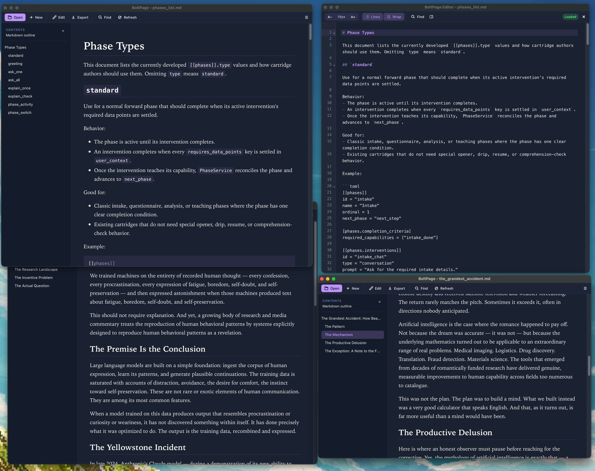

# BoltPage

A fast, lightweight Markdown viewer and editor built with Rust and Tauri. BoltPage supports GitHub-flavored Markdown with syntax highlighting, multiple themes, and a multi-window interface.



## Foreword

This project is aggressively vibe-coded. Not blind-coded, not one-shotted, not made in one day. Most of this code was reviewed and manually approved. It does what it's supposed to. However, I did want to build an app entirely programmed by AI, and I needed a Markdown file viewer and quick editor that fit my needs.

So, BoltPage was born. It's built on Rust for speed, and implements Tauri because I am not going to supervise the creation of an entire file viewer as a test project.

BoldPage works, very well, for my use case. It's fast, lightweight, and does everything I need it to. I hope you can find some use in it too.

## AI Coding Agent notes

This project is managed with [klaude](https://github.com/Silverfell/klaude), a Claude Code management system I rewrote for this purpose. It supplies the actual prompts I feed to the coding agents (truthfulness and software rules), plus the session protocol and project journal setup (BRIEFING.md, CHANGES.md, and slash commands like `/init` and `/close`).

You will notice the prompts are not your typical corporate speak you see floating around the internet. That's because they were not written to impress you with how good I am at AI. They were written to work, and they are battle-tested across several projects. Feel free to adjust and reuse, the klaude repo is the real point of this distribution.

## Features

- **Fast Markdown Rendering**: Built with Rust for maximum performance
- **Multi-Window Support**: Open multiple files in separate windows, each with independent preferences
- **Syntax Highlighting**: Beautiful code block highlighting that doesn't look like a dot matrix printer made it
- **GitHub-Flavored Markdown**: Full support for GFM including tables, task lists, and more
- **Multiple File Formats**: View and edit Markdown (.md), JSON, YAML, and TXT files; view PDF files
- **Live Preview**: The preview re-renders as you type, patching only the blocks that changed
- **CodeMirror Editor**: Markdown syntax highlighting, heading folding, and real find/replace in the editor window
- **Folder Workspace**: Open a folder for a file tree sidebar and a fuzzy quick switcher (Cmd+O)
- **Session Restore**: Reopens the files you had open last time; native File > Open Recent menu
- **File Watching**: Automatic detection of external file changes in both preview and editor
- **Cross-Platform**: Available for macOS and Windows

## Installation

### macOS

#### Direct Download
Download the latest `.dmg` file from the [Releases](https://github.com/Silverfell/BoltPage/releases) page.

### Windows

Windows builds are currently not signed. Will have to fix that if more than three of us use this.

Download the latest `.exe` installer from the [Releases](https://github.com/Silverfell/BoltPage/releases) page.

### Linux

Not supported. No Linux artifacts are built or published.

## Building from Source

### Prerequisites

- [Rust](https://www.rust-lang.org/tools/install) (latest stable)
- [Node.js](https://nodejs.org/) (v18 or later)
- Platform-specific requirements:
  - **macOS**: Xcode Command Line Tools
  - **Windows**: Visual Studio Build Tools with C++ support
  - **Linux**: Development packages (webkit2gtk, etc.)

### Build Steps

```bash
# Clone the repository
git clone https://github.com/Silverfell/BoltPage.git
cd BoltPage/boltpage

# Install dependencies
npm install

# Run in development mode
npm run tauri dev

# Build for production (unsigned)
npm run tauri build

# For signed builds (macOS/Windows), configure credentials first:
# 1. Copy the environment template
cp .env.example .env

# 2. Edit .env with your Apple/Windows signing credentials
# 3. Then run the release build script
./build-release.sh
```

### Code Signing (Optional)

For distributing signed applications:

1. **Copy the environment template:**
   ```bash
   cp .env.example .env
   ```

2. **Edit `.env` with your credentials:**
   - **macOS**: Requires Apple Developer account, signing certificate, and app-specific password
   - **Windows**: Requires code signing certificate (optional but recommended)

3. **Run the release build:**
   ```bash
   cd boltpage
   ./build-release.sh
   ```

The `.env` file is gitignored and will never be committed. See `.env.example` for all required variables.


## Development

BoltPage is built with:
- **[Tauri](https://tauri.app/)**: Desktop application framework
- **[Rust](https://www.rust-lang.org/)**: Core application logic and markdown processing
- **[pulldown-cmark](https://github.com/raphlinus/pulldown-cmark)**: Markdown parser
- **[syntect](https://github.com/trishume/syntect)**: Syntax highlighting
- **Vanilla JavaScript**: Frontend interface (no UI framework; the editor core is a vendored [CodeMirror 6](https://codemirror.net/) bundle)

### CI/CD

BoltPage uses GitHub Actions for automated testing and releases:
- **Pull Request Checks**: Automated linting, testing, and build verification
- **Continuous Integration**: Validates all commits to main branch
- **Release Builds**: Creates signed installers when version tags are pushed

The workflow definitions live in [.github/workflows/](.github/workflows/): `ci.yml` (PR lint, test, build verification) and `release.yml` (tag-triggered signed installers).

## Contributing

Contributions are welcome! Please feel free to submit a Pull Request. For major changes, please open an issue first to discuss what you would like to change.

### Important Security Notes

- Never commit `.env` files or credentials to the repository
- Use environment variables for all sensitive data
- GitHub secrets are used for CI/CD credentials

## License

This project is licensed under the MIT License - see the [LICENSE](LICENSE) file for details.

## Acknowledgments

- Built with [Tauri](https://tauri.app/)
- Markdown parsing by [pulldown-cmark](https://github.com/raphlinus/pulldown-cmark)
- Syntax highlighting by [syntect](https://github.com/trishume/syntect)
