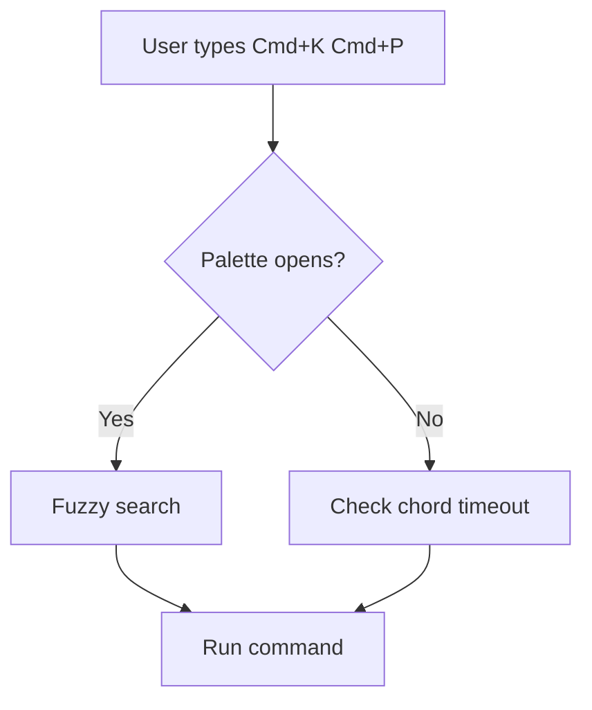
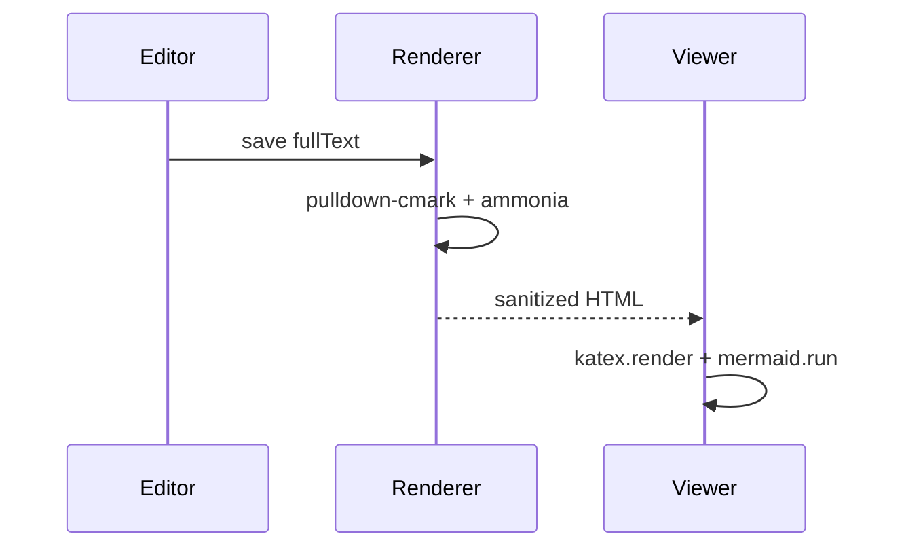

# BoltPage 2.1.0 — Tier 1 Smoke Test

This file exercises the 2.1.0 feature set: callouts, auto-link paste, command palette, math, mermaid, format shortcuts, heading fold, and font presets.

## Callouts

> [!NOTE]
> Plain notes look like this. This is the default/most-neutral callout.

> [!TIP]
> Tips use the success color. Inline `code` and **bold** should still work inside a callout body.

> [!IMPORTANT]
> Important callouts get a purple accent. Multi-line bodies should flow as expected, with the first paragraph adjacent to the title and subsequent paragraphs following.

> [!WARNING]
> Warnings use the amber/warning color. They're for things the reader should be careful about.

> [!CAUTION]
> Cautions use the danger color. They're for things that can break or cause data loss.

## Links

Plain reference: <https://example.com>

Inline link: [Anthropic](https://www.anthropic.com) for comparison.

To test paste-over-selection: select the word **docs** below and paste any `https://…` URL; it should become a markdown link.

Select me: **docs**.

## Mermaid





## Math

Inline: Euler's identity $e^{i\pi} + 1 = 0$ is beautiful because $e$, $\pi$, $i$, $1$, and $0$ meet in one line.

Display:

$$\int_{-\infty}^{\infty} e^{-x^2}\,dx = \sqrt{\pi}$$

$$\frac{\partial u}{\partial t} = \alpha \nabla^2 u$$

## Code fences (for the syntect regression fix)

Rust:

```rust
fn main() {
    let greeting = "Hello, 2.1.0!";
    println!("{greeting}");
}
```

Python:

```python
def fib(n: int) -> int:
    a, b = 0, 1
    for _ in range(n):
        a, b = b, a + b
    return a
```

JSON:

```json
{
  "version": "2.1.0",
  "features": ["math", "mermaid", "callouts", "palette"]
}
```

## Headings for fold testing

### Section A

Some content under A. Click the ▾ on the `### Section A` gutter line to fold this section.

Another paragraph under A.

### Section B

Content under B. This should fold independently of A.

- List item 1
- List item 2
- List item 3

### Section C

Content under C.

#### Subsection C.1

Nested content. Folding `### Section C` hides this subsection and everything after it until `### Section D` or a same-or-higher heading.

#### Subsection C.2

More nested content.

### Section D

Final section. Folding this hides nothing after it.
